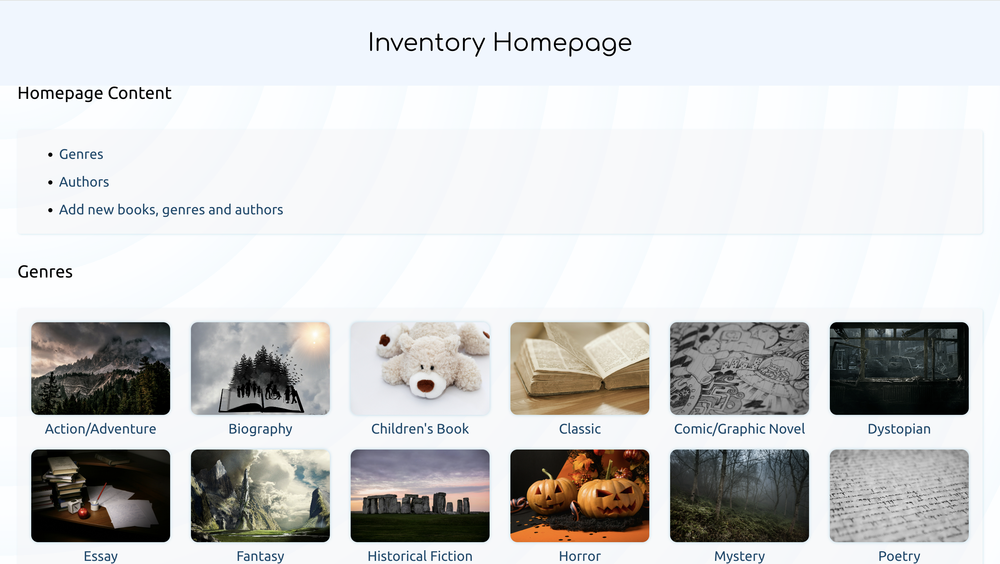

<a id="top"></a>

<div align="center">
    <a href="https://github.com/NestorNebula/inventory-application">
        
    </a>
    
<h3>Inventory Application</h3>
</div>

## Description



This project is an Inventory Management App for an imaginary book store.

The app has items (books) and categories (genres, authors).

Users can create, read, update and delete any of these items/categories. (For security reasons, unknown users will only be able to create and read objects).

### Built With

[](https://nodejs.org/)
[](https://expressjs.com/)
[](https://www.postgresql.org/)

#### And


## Getting Started

This is a guide to run this project locally.

### Prerequisites

- NPM
- NodeJS
- PostgreSQL

### Installation

<a id="installation"></a>

1. Fork the repository
2. Clone the forked repository to your local machine
   ```
   git clone git@github.com:<your username>/<repo name>.git
   ```
3. Update remote URL

   ```
   # SSH:
   git remote add upstream git@github.com:inventory-application/<repo name>.git

   # HTTPS:
   git remote add upstream https://github.com/inventory-application/<repo name>.git
   ```

4. Install required packages
   ```
   npm install
   ```
5. Create a postgreSQL database
6. Create a .env file in the project root directory with the following keys
   ```
   PORT=8080
   LOCAL_DB (or PRODUCTION_DB)=postgresql://<role_name>:<role_password>@localhost:5432/<your_db_name>
   PASSWD=<any_password> (This will be the password you will use for updating and deleting items/categories)
   ```
7. If you've set a local db key previously, make sure to update the following files. (This isn't needed if you've just updated the production db key)

   ```
   # Files: ./db/populatedb.js and ./db/pool.js

   Replace process.env.PRODUCTION_DB by process.env.LOCAL_DB
   ```

8.

- Go to the populatedb file
  ```
  # From route directory
  ./db/populatedb.js
  ```
- In the `SQL` variable, you can see the code that will create all the tables. In the insert queries you can add some data to populate your db (If you don't wish to add data, make sure to delete the insert statements to avoid error when populating the db.)

  ```
  # The lines where you can add data should look like this:
  INSERT INTO books (title, pages, plot, author_id)
  VALUES
   /* Add Books here */

  # Example:

  INSERT INTO books (title, pages, plot, author_id)
  VALUES
   ('My own book', 300, 'An interesting plot', <any existing author_id or NULL>)

  (Make sure to read ./modules/validation.js and the db contrainsts before running this)
  ```

9. Finally, you can populate the db by running the populatedb file.
   ```
   node ./db/populatedb.js
   ```

If an error occurs, make sure you have done everything properly according to this guide. If you think so, you can <a href="https://github.com/NestorNebula/inventory-application/issues">Open an Issue</a>.

## Usage

If you run this project locally, make sure that you have followed all steps in <a href="#installation">Installation</a>.

- Open the app.

  ```
  # If you run this project locally

  node --watch app.js

  Then search http://localhost:8080/ in you browser.
  ```

Once the app is opened, you can navigate through the different pages.

- In the Index page, you will be able to create new books, genres and authors.
- If you are running this project locally, in author/genre/book pages, you will be able to change their information or to delete them using the password you should have set.

<p align='right'>(<a href='#top'>go back to the top</a>)</p>

## Contributing

If you find an issue within the app, you can <a href="https://github.com/NestorNebula/inventory-application/issues">Open an Issue</a>.

## License

[](https://github.com/NestorNebula/inventory-application/blob/main/LICENSE)

## Contact

Noa Houssier - [Github](https://github.com/NestorNebula)

Project:

- [Repository](https://github.com/NestorNebula/inventory-application)
- [Link](https://inventory-application-2x7e.onrender.com)

## Acknoledgements

- [Dotenv](https://www.npmjs.com/package/dotenv)
- [Node Postgres](https://github.com/brianc/node-postgres)
- [Express Validator](https://express-validator.github.io/)

<p align='right'>(<a href='#top'>go back to the top</a>)</p>
